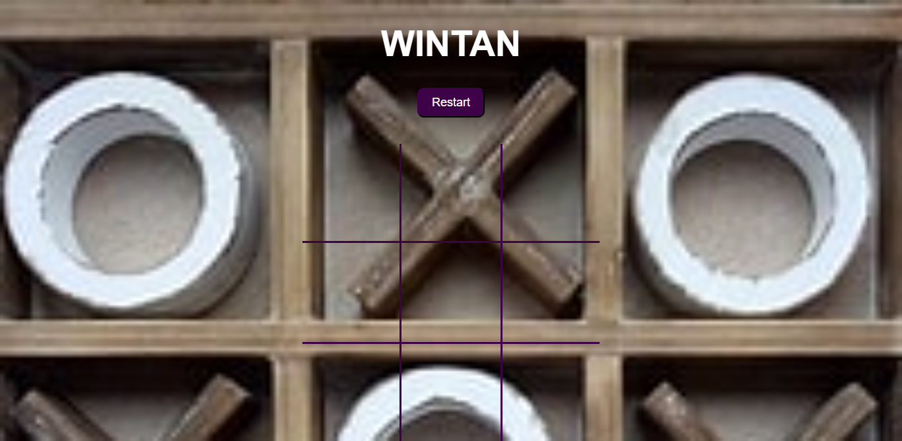

# Tic tac toe 

A simple tic-tac-toe project 

  

## Screenshots of the app.

[Live Demo Link](https://raw.githack.com/wintan1418/my-tic-tac-toe/feature/tic.html)

## Built With

- Javascript/ES6
- npm
- HTML/CSS
- Github Actions

## Prerequisities

To get this project up and running locally, you must follow the steps from the [getting started section](#getting-started).

## Getting Started

**To get this project set up on your local machine, follow these simple steps:**

**Step 1** 
Navigate through the local folder where you want to clone the repository and run 
git clone `https://github.com/wintan1418/my-tic-tac-toe`. This action will automatically clone the repo to your local folder. 

**Step 2** 
- Cd inside the project

- run npm run build

- Open the index.html in the browser.

## 🤝 contributing

Contributions, issues and feature requests are welcome!

👤 Author

Oluwadare Juwon

- Github: [@Oluwadare Juwon](https://github.com/wintan1418)
- Linkedin: (www.linkedin.com/in/oluwintan)
- Twitter: [Oluwadare-juwon](https://twitter.com/@oluwadarejuwon)

## 🙋‍♂ show your support

give a ⭐️ if you like this project!

## 📝 license

This project is [MIT](LICENSE) licensed.